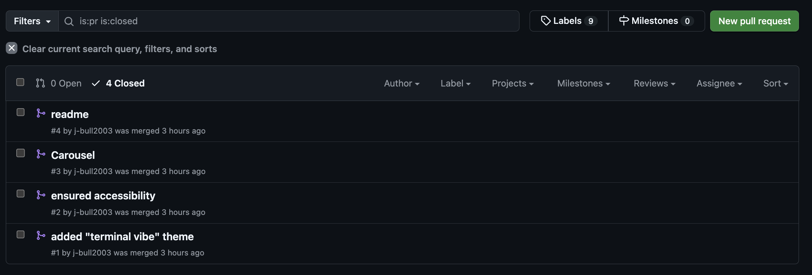
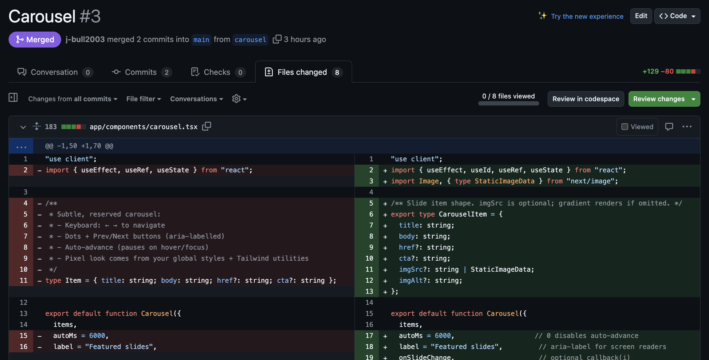

# CSE3WA — Moodle HTML Generator & Mini App
**Student:** Jessica Bull • **ID:** 20963232  
**Subject:** CSE3WA • **Institution:** La Trobe University  
**Stack:** Next.js (App Router, TypeScript), Tailwind CSS, next-themes

> A site that **generates copy-paste HTML + JS** (with **inline CSS**, **no classes**) ready for **Moodle**.  
> Includes Light/Dark/**CRT Pixel** themes, accessible navigation (Header, **Hamburger**, **Kebab**), a **Tabs Generator**, plus mini pages (Game, Todo, Blog).

**Live demo:** https://comfy-tarsier-46972b.netlify.app

---

## Table of Contents
- [1. Project Overview](#1-project-overview)
- [2. Requirements Mapping (Compliance)](#2-requirements-mapping-compliance)
- [3. Screenshots](#3-screenshots)
- [4. How to Run](#4-how-to-run)
- [5. Architecture & Structure](#5-architecture--structure)
- [6. Features](#6-features)
  - [6.1 Themes](#61-themes)
  - [6.2 Navigation](#62-navigation)
  - [6.3 Tabs Generator](#63-tabs-generator)
  - [6.4 Mini Pages](#64-mini-pages)
- [7. Accessibility](#7-accessibility)
- [8. Data Persistence (Cookies & Storage)](#8-data-persistence-cookies--storage)
- [9. GitHub Hygiene](#9-github-hygiene)
- [10. Video Demonstration Plan](#10-video-demonstration-plan)
- [11. References & Acknowledgements](#11-references--acknowledgements)
- [12. License / Academic Note](#12-license--academic-note)

---

## 1. Project Overview
This project implements **Part 1** of the assignment brief: a Next.js application that **builds HTML+JS for Moodle** blocks using only **inline CSS** (no classes). The app also demonstrates common HTML5 UI patterns (carousel, tabs, accordion, modal, dropdown, tooltip, progress, range slider, date picker, alerts, lightbox, canvas, CSS rotation, Mermaid code) as **inline examples** that can be exported with the Tabs Generator.

- **Student number** is visible **top-left** on every page.
- **Header** with Navigation + **Hamburger**/**Kebab** menus.
- **Themes**: Light / Dark / **CRT Pixel** (green “terminal vibe”).
- **Footer** with copyright, name, student number, and date.
- **Accessibility**: semantic roles, keyboard support, visible focus, AA contrast.
- **Cookies/Storage**: remembers menu/tab preferences; tabs persist while authoring.

---

## 2. Requirements Mapping (Compliance)
| Requirement | Where / How | Status |
|---|---|---|
| Next.js App (TypeScript, App Router) | Project scaffold via `create-next-app` | ✅ |
| Pages: Home, About, etc. | `app/page.tsx`, `app/about/page.tsx`, plus mini pages | ✅ |
| Student # top-left each page | Header badge shows **20963232** | ✅ |
| Header + Menu (Hamburger/Kebab) | `app/components/navigation.tsx` (+ transforms) | ✅ |
| Themes: Dark/Light/(Other) | Light / Dark / **CRT Pixel** via tokens + `next-themes` | ✅ |
| Footer: copyright, name, student #, date | `app/components/footer.tsx` | ✅ |
| Accessibility compliance | Landmarks, roles, a11y tabs, focus styles | ✅ |
| Cookies: remember menu tab | `last_menu`, tabs cookie in exported file | ✅ |
| About page: name, student #, video | `app/about/page.tsx` (video placeholder) | ✅ |
| **Homepage outputs code** | `QuickExport` widget — inline HTML+JS | ✅ |
| **Tabs Page**: up to 15 tabs (+/−), editable headings & content, localStorage | `app/tabs/page.tsx` | ✅ |
| **Output**: inline CSS only, no classes; works as `Hello.html` | Copy/Download from Tabs page | ✅ |
| Extra pages: Escape Room, Coding Races, Court Room | Placeholder pages created | ✅ |
| GitHub hygiene | Commits, branches, no `node_modules`, up-to-date README | ✅ |

---

## 3. Screenshots

- **Pull requests and branches**  
  
  
   
  
- **GitHub Commits**  
  

---

## 4. How to Run

```bash
# Node 18+ (Node 20 recommended)

# 1) Install
npm install

# 2) Dev server
npm run dev
# → http://localhost:3000

# 3) Build & start
npm run build
npm start
```

**Optional env:**
```bash
# .env.local
NEXT_PUBLIC_STUDENT_NUMBER=20963232
```

---

## 5. Architecture & Structure

```
app/
  components/
    header.tsx
    navigation.tsx         # hamburger + kebab + primary links
    hamburger.tsx
    kebab.tsx
    theme-providers.tsx
    theme-toggle.tsx
    theme-color.tsx
    carousel.tsx
    tabs.tsx               # in-site display tabs (not generator)
  about/page.tsx
  tabs/page.tsx            # Tabs Generator (exports Hello.html)
  play/page.tsx
  todo/page.tsx
  blog/page.tsx
  escape-room/page.tsx
  coding-races/page.tsx
  court-room/page.tsx
  page.tsx                 # Home
  layout.tsx               # App shell (Header/Main/Footer)
  globals.css              # Tailwind + theme tokens + background
public/
  data/me.jpeg             # example image
  slides/...               # carousel images
```

**Key design choices**
- **Tokens over utilities**: global CSS variables (`--bg`, `--ink`, `--card`, `--neon`) power theming (Light/Dark/CRT).
- **No server data**: hydration-safe UI; theme computed post-mount to avoid mismatch.
- **A11y first**: landmark roles, ARIA on menus/tabs, keyboard flows.

---

## 6. Features

### 6.1 Themes
- **Light**, **Dark**, and **CRT Pixel (terminal)** via `next-themes` mapping:
  - `value={{ light: "light", dark: "dark", crt: "crt" }}`
- Tokens in `globals.css`: `:root` (Light), `.dark`, `.crt`
- Mobile address bar tint synced via `ThemeColorMeta`.

### 6.2 Navigation
- **Hamburger** (☰) for the secondary section (Escape Room, Coding Races, Court Room).
- **Kebab** (⋮) quick menu (Todo, Play, Blog).
- CSS **transform** transitions, ARIA: `aria-haspopup="menu"`, `aria-expanded`, `aria-controls`.

### 6.3 Homepage Quick Export
- Small generator that outputs a **single-file** HTML + vanilla JS page with **inline CSS only** (no `class=`).
- Use **Copy HTML** or **Download Hello.html**; open directly in any browser.

### 6.4 Tabs Generator
- Up to **15 tabs** with **Add (+)** / **Remove (−)**.
- Editable **headings** and **content (HTML allowed)**.
- **localStorage** persists while authoring.
- **Output**: full HTML document using **inline styles only**; tabs are A11y-compliant (roles, focus, keyboard).
- Optional cookie to remember the **active tab** in the exported file.

**Required video outputs (all demonstrated):**
1. **1 tab**  
2. **3 tabs**  
3. **5 tabs**  
Each creates a working **Hello.html** with **no CSS classes**.

### 6.5 Mini Pages
- **Play**: Tic-Tac-Toe (based on React tutorial; modernized).
- **Todo**: local tasks with keyboard support.
- **Blog**: client-only create/search/read posts.
- **Escape Room / Coding Races / Court Room**: placeholder pages for later parts.

---

## 7. Accessibility
- **Landmarks**: `<header>`, `<nav>`, `<main id="main">`, `<footer>`
- **Skip link** to `#main`
- **Visible focus** with `:focus-visible` rings
- **Menus**: ARIA menu-button pattern (`aria-haspopup="menu"`, `aria-expanded`)
- **Tabs**: `role="tablist" / "tab" / "tabpanel"`, Arrow/Home/End navigation, focus management
- **Color contrast**: token palettes tuned to ≥ AA; themes controlled via variables
- **Reduced motion** respected for scanline animation

---

## 8. Data Persistence (Cookies & Storage)
- **Cookies**
  - `last_menu` — remembers last route (90 days)
  - Exported Hello.html: `last_active_tab_index` — reopens last active tab
  - Tabs page preference: `builder_tabs_remember`
- **localStorage**
  - Draft tabs (title/content) persist while editing on `/tabs`

---

## 9. GitHub Hygiene
- **Main** branch + **feature branches**:
  - `feat/tabs-generator`
  - `feat/themes-crt`
  - `feat/nav-menus`
- **Several commits** with descriptive messages.
- `.gitignore` excludes `node_modules`.
- **README** kept up to date.

**Screenshots (placeholders):**
- Commits: `docs/screenshots/commits.png`  
- Branches: `docs/screenshots/branches.png`

---

## 10. Video Demonstration Plan
**Length:** 3–8 minutes.  
**Covers:** UI (Header/Nav/Footer/About), Themes (Light/Dark/CRT), Menus (Hamburger/Kebab w/ transforms), Tabs Generator ops (up to 15 tabs, edit headings/content, localStorage), **three outputs** (1/3/5 tabs) as working **Hello.html**, GitHub hygiene.

> A ready-to-read script is included in the project notes (see `docs/video-script.md` or the script provided in chat).

---

## 11. References & Acknowledgements
- GeeksforGeeks — Next.js Todo app concepts  
- LogRocket — Hamburger menu UX patterns  
- React Official Tutorial — Tic-Tac-Toe  
- GeeksforGeeks — Blogging platform with Next.js  

---

## 12. License / Academic Note
Coursework for **CSE3WA** at **La Trobe University**.  
Not for commercial use without permission. Please credit the author when referencing design or code.

---